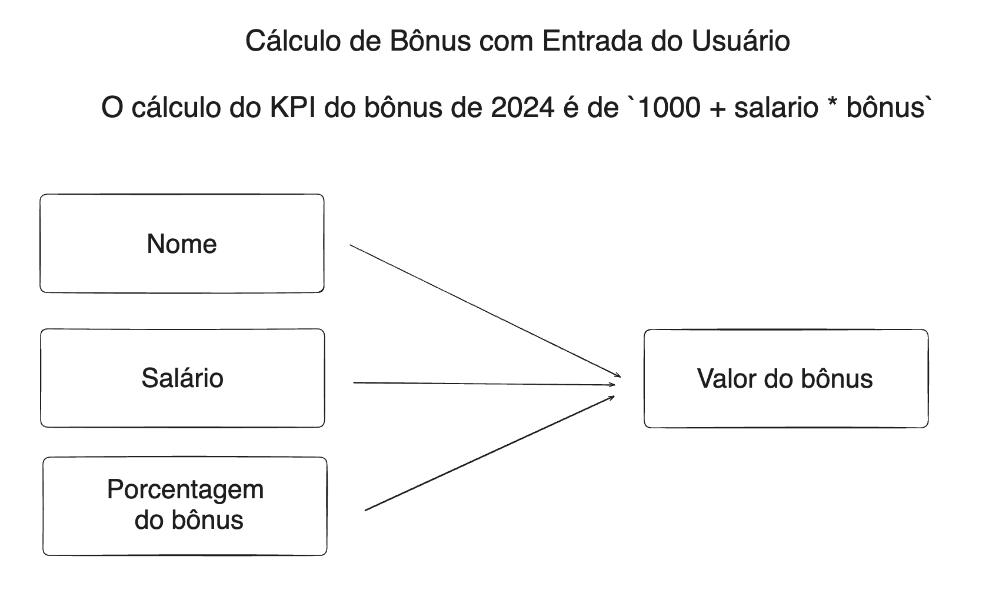
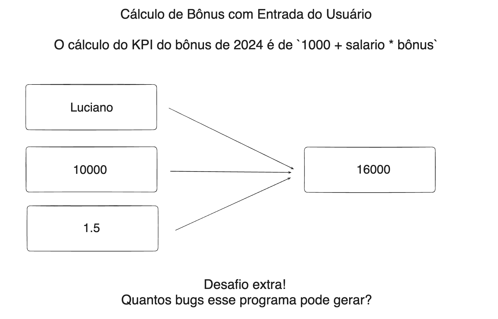

# Aula 01

## Desafio da aula 01: Cálculo de Bônus com Entrada do Usuário

Escreva um programa em Python que solicita ao usuário para digitar seu nome, o valor do seu salário mensal e o valor do bônus que recebeu. O programa deve, então, imprimir uma mensagem saudando o usuário pelo nome e informando o valor do salário em comparação com o bônus recebido.

